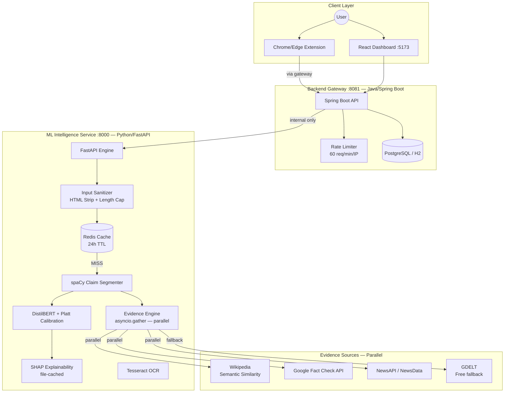

# AIVera — Explainable Fake News Detection Ecosystem

## 1. Project Overview

AIVera is a secure, full-stack AI ecosystem designed to combat misinformation through advanced credibility analysis and transparent explainability. Unlike traditional "black-box" models, AIVera:

- Segments content into individual **declarative claims** and evaluates each independently.
- Produces **calibrated confidence scores** (Platt scaling applied to DistilBERT's raw softmax output).
- Explains every prediction with **word-level SHAP attributions** and explicit uncertainty communication.
- Verifies claims against **four parallel evidence sources**, each tagged with a domain credibility weight.
- Enforces **security-by-design**: SSRF protection on URL inputs, HTML sanitization, CORS lockdown, and rate limiting.

The system accepts raw text, social media screenshots (via OCR), PDF documents, and direct URLs.

---

## 2. System Architecture

AIVera follows a secure microservices 3-tier architecture. The browser extension routes through the Spring Boot gateway — the ML service is strictly internal and never browser-accessible.

### Architectural Diagram



### Component Roles

| Component | Responsibility |
|-----------|---------------|
| **React Frontend** | Dashboard, SHAP visualization, history archive, theme toggle |
| **Spring Boot Gateway** | CORS, rate limiting, analysis persistence, proxying to ML service |
| **FastAPI ML Service** | NLP, model inference, evidence retrieval, XAI, caching |
| **Browser Extension** | Lightweight popup — routes through gateway, not ML service directly |
| **Redis** | Result caching (24h TTL); graceful no-op if unavailable |

---

## 3. Security Architecture

### 3.1 SSRF Protection (`url_service.py`)

The `/extract-url` endpoint validates every URL before making any outbound HTTP request:

1. Scheme must be `http` or `https`.
2. Hostname is resolved via DNS.
3. Resolved IP is checked against all blocked ranges before connection:

| Blocked Range | Reason |
|--------------|--------|
| `10.0.0.0/8`, `172.16.0.0/12`, `192.168.0.0/16` | RFC 1918 private networks |
| `127.0.0.0/8` | Loopback / localhost |
| `169.254.0.0/16` | Link-local / AWS EC2 metadata endpoint |
| `100.64.0.0/10` | Shared address space |
| `::1/128`, `fc00::/7`, `fe80::/10` | IPv6 equivalents |

### 3.2 Input Sanitization (`main.py`)

All text inputs are sanitized before entering the NLP pipeline or database:
- `<script>` and `<style>` blocks are removed entirely.
- All remaining HTML tags stripped via regex.
- Hard length cap: **50,000 characters** (HTTP 413 if exceeded).

### 3.3 CORS Lockdown

- **ML Service**: only `http://localhost:8081` (gateway) allowed.
- **Spring Boot Gateway**: only `http://localhost:5173` and `http://localhost` allowed.

### 3.4 Rate Limiting (`ApiKeyInterceptor.java`)

- Default: 60 requests/minute per IP on all `/api/**` endpoints.
- Clients with a valid `X-API-KEY` header bypass IP throttling.

---

## 4. Core Features & Methodology

### 4.1 Explainable AI (SHAP)

SHAP (SHapley Additive exPlanations) provides word-level attribution. For each token:
- Positive impact → pushes score toward "Real/Credible."
- Negative impact → pushes score toward "Fake/Suspicious."

**Important caveats communicated to users:**
- Attributions are indicative only; they reflect statistical associations in training data.
- The model may be unreliable on political claims, satire, and emerging topics.
- SHAP file-caching (`cache/shap/<md5>.json`) avoids recomputation for identical inputs.

### 4.2 Calibrated Confidence Scoring

Raw DistilBERT softmax output is **not** a probability — it is overconfident. Platt scaling is applied:

```
p_calibrated = 1 / (1 + exp(A × raw_score + B))
```

Default parameters `A = -2.0, B = 0.5` pull extreme values toward the interior without changing mid-range order. Replace with values from `sklearn.calibration.CalibratedClassifierCV` after calibration on held-out data.

### 4.3 Uncertainty Communication

When a claim's calibrated score falls in **[0.35, 0.65]**, the UI shows an amber warning banner:

> ⚠️ **Low confidence** — this claim score is near 0.5, meaning the model is uncertain. Treat this result with caution and consider manual verification from primary sources.

### 4.4 Multi-Source Evidence Retrieval

All four sources are fetched **in parallel** (`asyncio.gather()`). Each snippet is tagged with a domain credibility weight:

| Source | Credibility Weight |
|--------|-------------------|
| Reuters, AP News | 1.0 |
| BBC, NPR | 0.95 |
| NYT, Washington Post, Economist | 0.90 |
| Snopes, PolitiFact, FactCheck.org | 0.90 |
| CNN | 0.75 |
| Unknown/unrecognized | 0.60 (default) |

**GDELT fallback**: When NewsAPI/NewsData returns no results (e.g., daily cap reached), GDELT (Global Knowledge Graph) is used automatically. GDELT is free with no daily request limit.

### 4.5 Redis Caching

- Cache key: SHA-256 of normalized (lowercase, trimmed) input text.
- TTL: 24 hours.
- Cache includes: overall credibility, all claim analyses, evidence snippets, SHAP explanations.
- Falls back to no-op gracefully if Redis is unavailable.

---

## 5. Technology Stack

| Layer | Technologies |
|:------|:------------|
| **Frontend** | React 18, Vite, Tailwind CSS, Framer Motion, Recharts, Lucide Icons |
| **Backend** | Java 17, Spring Boot 3.x, Spring Data JPA, PostgreSQL / H2 |
| **ML Service** | Python 3.10, FastAPI, PyTorch, HuggingFace (DistilBERT), SHAP, spaCy, SentenceTransformers, Tesseract OCR |
| **Caching** | Redis 7 (optional) |
| **Observability** | Python `logging`, Prometheus (`prometheus-fastapi-instrumentator`) |
| **DevOps** | Docker, Docker Compose, PowerShell Scripting |

---

## 6. API Reference

### ML Service (Internal — `:8000`)

| Method | Endpoint | Description |
|--------|----------|-------------|
| `POST` | `/analyze/text` | Analyze plain text (`text` form field) |
| `POST` | `/analyze/file` | Analyze PDF or image upload |
| `POST` | `/extract-url` | SSRF-protected URL article extraction |
| `GET`  | `/health` | Health check with model load status |
| `GET`  | `/metrics` | Prometheus metrics |

### Backend Gateway (Public — `:8081`)

| Method | Endpoint | Description |
|--------|----------|-------------|
| `POST` | `/api/detection/text` | Analyze text (proxied + persisted) |
| `POST` | `/api/detection/file` | Analyze file (proxied + persisted) |
| `POST` | `/api/detection/extract-url?url=...` | URL extraction (SSRF-safe) |
| `GET`  | `/api/detection/history` | All saved analyses |
| `GET`  | `/api/detection/{id}` | Report by ID |

---

## 7. Observability

### Structured Logging

Every pipeline run emits log lines with:
- Anonymized **input hash** (SHA-256 — no raw text logged)
- **Prediction label** and **calibrated confidence score**
- **Evidence sources hit** and count
- **Per-stage latency** (NLP, model inference, evidence retrieval, total)

```
[a3f2b1] cache=MISS — running full pipeline
[a3f2b1] label=FAKE  score=0.3241  status=CONTRADICTED  nlp_ms=45  model_ms=312  evidence_ms=891  evidence_count=5
[a3f2b1] pipeline=DONE  overall_score=0.3241  claims=1  total_ms=1248
```

### Prometheus Metrics

`GET /metrics` exposes request count, latency histograms, and error rates. Compatible with Grafana out of the box.

---

## 8. Setup & Installation

### Prerequisites

- Node.js v18+
- Java JDK 17+
- Python 3.10+
- Tesseract OCR (in system PATH)
- Redis (optional — caching degrades gracefully without it)

### Environment Configuration

```bash
cp ml-service/.env.example ml-service/.env
# Edit ml-service/.env with your API keys
```

Required keys:

| Variable | Purpose |
|----------|---------|
| `GOOGLE_API_KEY` | Google Fact Check Tools API |
| `NEWS_API_KEY` | NewsAPI.org or NewsData.io (optional — GDELT is free fallback) |
| `REDIS_HOST` | Redis hostname (default: `localhost`) |
| `REDIS_PORT` | Redis port (default: `6379`) |
| `TESSERACT_CMD` | Path to Tesseract binary |

### Quick Start (Windows)

```powershell
powershell -ExecutionPolicy Bypass -File .\start.ps1
```

### Docker Compose

```bash
docker compose up --build
```

Launches: PostgreSQL → Redis → ML Service (with health check) → Spring Boot → React Frontend.

The ML service exposes `/health`; Docker Compose waits for it to return `{"status":"ok"}` before starting the backend (60s start_period for model warm-up).

### Manual Start

```bash
# ML Service
cd ml-service && pip install -r requirements.txt && python main.py

# Backend (new terminal)
cd backend && mvn spring-boot:run

# Frontend (new terminal)
cd frontend && npm install && npm run dev
```

---

## 9. Browser Extension

The extension routes all traffic through the Spring Boot gateway (port `8081`), not the ML service directly. This ensures rate limiting and audit trails apply to extension requests.

**Setup**: Load `extension/` as an unpacked extension in `chrome://extensions` (Developer mode).

**Usage**: Highlight any text → right-click → *Analyze with AIVera* → view credibility score and evidence in the popup.

---

## 10. Future Enhancements

- **DeBERTa-v3 / RoBERTa**: Upgrade from DistilBERT for 4–8 point F1 improvement on LIAR.
- **LIME as SHAP alternative**: Much faster per-prediction; useful for real-time UX.
- **FAISS vector store**: Pre-embed canonical fact-check topics; eliminate per-request Wikipedia embedding.
- **Feedback loop**: Allow users to flag incorrect predictions; log disagreements as a fine-tuning dataset.
- **Internationalization**: `paraphrase-multilingual-MiniLM-L12-v2` for 50+ language support.
- **Message queue**: RabbitMQ/Redis Streams for async heavy jobs (large PDFs, bulk URL analysis).
- **User authentication**: OAuth2/JWT for personalized history and per-user rate limits.
