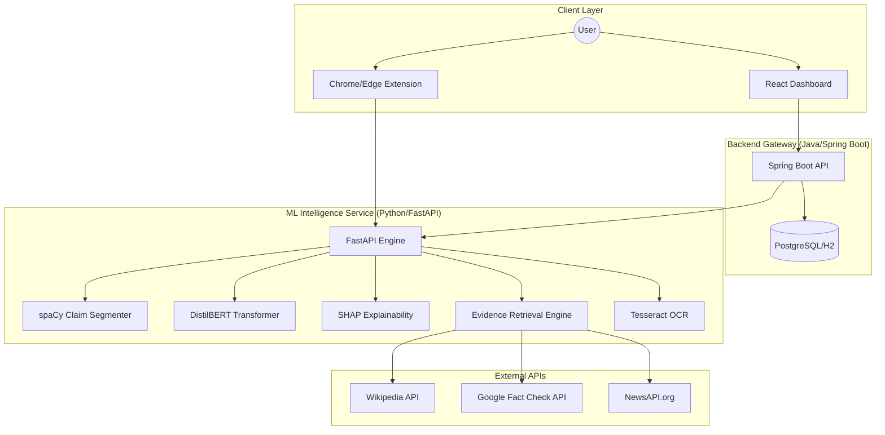

# AIVera - Explainable Fake News Detection Ecosystem

## 1. Project Overview
AIVera is a high-performance, full-stack AI ecosystem designed to combat misinformation through advanced credibility analysis and transparent explainability. Unlike traditional "black-box" models, AIVera provides users with granular evidence and visual representations of why a claim is flagged as suspicious.

The system handles diverse inputs, including raw text, social media screenshots (via OCR), PDF documents, and direct URLs, making it a versatile tool for real-world fact-checking.

## 2. System Architecture
AIVera follows a microservices-inspired 3-tier architecture, ensuring scalability and separation of concerns.

### Architectural Diagram

### Components Interaction
1.  **Frontend (React)**: Provides an interactive dashboard for users to upload files, paste text, or view analysis history.
2.  **Backend Gateway (Spring Boot)**: Acts as the central orchestrator, managing data persistence in PostgreSQL and proxying analysis requests to the ML service.
3.  **ML Service (FastAPI)**: The core engine that performs NLP tasks, model inference, evidence gathering, and explainability (XAI) processing.
4.  **Browser Extension**: Offers lightweight, real-time analysis tools that interact directly with the ML service for instant credibility scores while browsing.

## 3. Core Features & Methodology

### 🧠 Explainable AI (XAI)
AIVera utilizes **SHAP (SHapley Additive exPlanations)** to provide word-level attribution. This allows users to see exactly which words or phrases (e.g., "shocking", "unverified") most heavily influenced the AI's credibility score.

### 🔍 Multi-Source Evidence Retrieval
For every claim, AIVera performs real-time verification across three major sources:
*   **Google Fact Check API**: Leverages professionally verified fact-checkers.
*   **Wikipedia (Live Search)**: Uses semantic similarity (`all-MiniLM-L6-v2`) to find relevant context.
*   **NewsAPI**: Pulls the latest news articles for real-time contextual validation.

### 🖼️ OCR & Multi-Format Support
Integrated **Tesseract OCR** allows the system to analyze screenshots of social media posts, news headlines, and complex PDF documents.

## 4. Technology Stack (Tech Stack)

| Layer | Technologies |
| :--- | :--- |
| **Frontend** | React 18, Vite, Tailwind CSS, Recharts, Lucide Icons |
| **Backend** | Java 17, Spring Boot 3.x, Spring Data JPA, PostgreSQL / H2 |
| **ML Service** | Python 3.10, FastAPI, PyTorch, HuggingFace (DistilBERT), SHAP, spaCy, Tesseract OCR |
| **DevOps** | Docker, Docker Compose, PowerShell Scripting |

## 5. Key API Endpoints (ML Service)

*   `POST /analyze/text`: Processes raw text, segments it into claims, and returns analysis + XAI.
*   `POST /analyze/file`: Handles PDF/Image uploads using OCR before analysis.
*   `POST /extract-url`: Scrapes content from a provided URL for analysis.

## 6. Setup and Installation

### Prerequisites
- Node.js (v18+)
- Java JDK 17+
- Python 3.10+
- Tesseract OCR (installed & in system PATH)

### Quick Start (Manual)
1.  **ML Service**: `pip install -r requirements.txt` and run `python main.py`.
2.  **Backend**: `mvn spring-boot:run`.
3.  **Frontend**: `npm install` and `npm run dev`.

*Alternatively, use the automated [.\start.ps1](file:///d:/Study/projects/fake_news/fake_news/start.ps1) script in the root directory.*

## 7. Future Enhancements & Suggestions
*   **Fine-tuning**: Training the model on more domain-specific datasets (e.g., healthcare or political misinformation).
*   **Real-time Collaboration**: Allowing users to flag and contribute to the evidence database.
*   **User Authentication**: Implementing full OAuth2/JWT for personalized analysis history.
